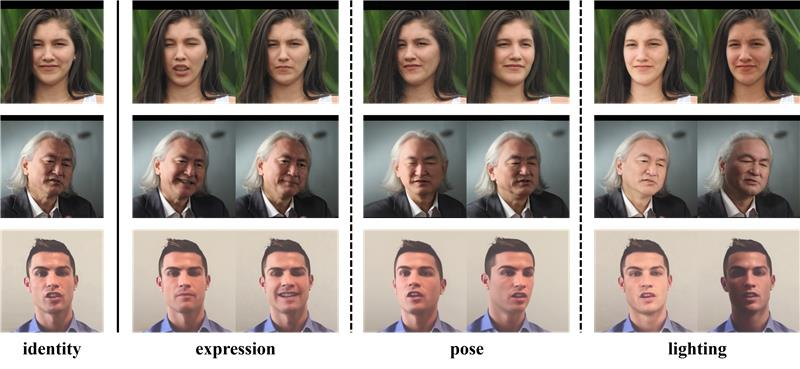

<div align="center">

# Towards Consistent and Controllable Image Synthesis for Face Editing


Mengting Wei, Tuomas Varanka, Yante Li, Xingxun Jiang, Huai-Qian Khor, Guoying Zhao


University of Oulu


### [Paper](https://arxiv.org/abs/2502.02465)

</div>

## :mega: Updates

[4/3/2024] Inference code and pre-trained models are released.


## Introduction

We present RigFace, an efficient approach to edit the expression, pose and lighting with consistent 
identity and other attributes from a given image.



## Installation

To deploy and run RigFace, run the following scripts:
```
conda create -n rigface python=3.9
conda activate rigface
pip install torch==1.13.0+cu116 torchvision==0.14.0+cu116 torchaudio==0.13.0 --extra-index-url https://download.pytorch.org/whl/cu116
pip install -r requirements.txt
conda install -c fvcore -c iopath -c conda-forge fvcore iopath
pip install --no-index --no-cache-dir pytorch3d -f https://dl.fbaipublicfiles.com/pytorch3d/packaging/wheels/py39_cu116_pyt1130/download.html
```

## Download models and data 

- Download utils files for pre-processing from [Huggingface](https://huggingface.co/mengtingwei/rigface/tree/main).
Put them in the `utils` directory.
- Download pre-trained weights of our model from the same website.
- Make a new directory `data` inside the `utils`.
- Download pre_trained DECA model `deca_model.tar` from [here](https://github.com/yfeng95/DECA). 
Put it in the `data`.
- Download `generic_model.pkl` from [FLAME2020](https://flame.is.tue.mpg.de/download.php).
Also put it under `data`.
- Download `FLAME_texture.npz` from [FLAME texture space](https://flame.is.tue.mpg.de/download.php).
Put it in `data`.
- Download other files in [DECA page](https://github.com/yfeng95/DECA/tree/master/data). Put all the files under `data`.

```
...
pre_trained
    -unet_denoise
        ...
    -unet_id
        ...
utils
    -checkpoints
        ...
    -third_party
        ...
    -third_party_files
        ...
    -data
        ...
    ...
```

## Test with our examples


```
python inference_rigface.py --id_path utils/test_images/id1/sor.png --bg_path utils/test_images/id1/bg_pose+exp.png --exp_path utils/test_images/id3/exp_pose+exp.npy --render_path utils/test_images/id3/render_pose+exp.png --save_path ./res
```

You will find the edited image under `res` directory.


## Test your own data

1. First, you need to ensure that both the source and target images have a resolution of 512x512.

```
cd utils
python preprocess.py --img_path <your-image-path> --save_path <your-save-path>
```

2. Parse background using the resized source and target images. We provide an example here.

```
python make_bgs.py --sor_path ./test_images/id1/sor.png --tar_path ./test_images/id1/tar.png --modes pose+exp
```

If you want to edit only one mode, just provide the single mode (for example '--modes exp') here. 

3. Compute the expression coefficients. For the case of editing lighting or pose, 
the coefficients will be computed from the source image, and for the case of expression,
they will be computed from the target image.

```
python save_exp_coeffs.py --sor_path ./test_images/id1/sor.png --tar_path ./test_images/id1/tar.png --mode pose+exp
```

4. Compute the rendering according to the edit modes.

```
python compute_renders.py --sor_path ./test_images/id1/sor.png --tar_path ./test_images/id1/tar.png --mode pose+exp
```

5. Then do the inference using all the conditions generated.

## Acknowledgements

This project is built on source codes shared by [DECA](https://github.com/yfeng95/DECA),
[Deep3DRecon](https://github.com/sicxu/Deep3DFaceRecon_pytorch),
[faceParsing](https://github.com/zllrunning/face-parsing.PyTorch) and
[ControlNet](https://github.com/huggingface/diffusers/blob/main/examples/controlnet/train_controlnet.py).